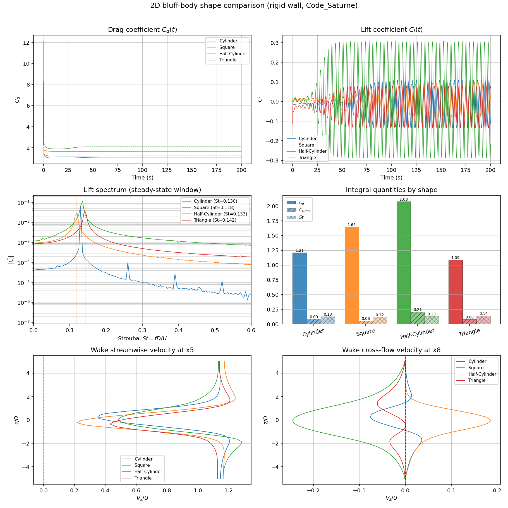
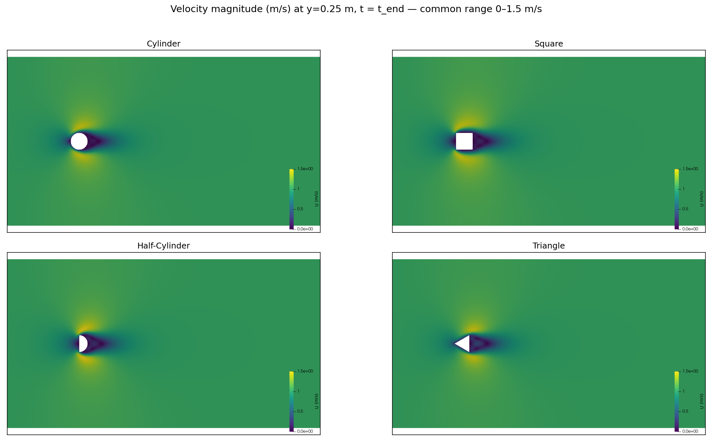

# 2D Cross-Flow Bluff-Body Shape Comparison

Code_Saturne k-omega SST study of four bluff shapes (circular cylinder, square,
half-cylinder with flat face upstream, and apex-forward equilateral triangle)
in a 10 m x 5 m x 0.5 m quasi-2D domain. Characteristic dimension D = 0.5 m,
free-stream U = 1 m/s, dt = 0.1 s, 2000 time steps, rigid walls (no FSI),
2 MPI ranks per case, ~6.4k hex cells per mesh.

---

## How to run

The orchestration produces four self-contained Code_Saturne cases
(`case_cylinder/`, `case_square/`, `case_half_cylinder/`, `case_triangle/`),
a parametric Gmsh generator, and post-processing scripts that emit the
comparison figure and the 2x2 velocity-magnitude contour panel.

**Generate a mesh for a new shape:**
```bash
cd agent-orchestration-claude
python3 MESH/generate_shape_mesh.py --shape cylinder       --out MESH/cylinder.msh
python3 MESH/generate_shape_mesh.py --shape square         --raf 4
python3 MESH/generate_shape_mesh.py --shape half_cylinder
python3 MESH/generate_shape_mesh.py --shape triangle
```
The script writes Gmsh v2.2 ASCII with physical-surface tags `inlet`,
`outlet`, `cylindre`, `symmetry`, `updown` matching the `setup.xml`
boundary-condition selectors.

**Add a new case manually:**
```bash
cp -r case_cylinder case_<newshape>
# Edit case_<newshape>/DATA/setup.xml — change <mesh name="...msh"/> to your file
export PATH="/home/katsa1k/apps/code_saturne/v9.0/arch/bin:$PATH"
cd case_<newshape> && code_saturne run
```
`run.cfg` already selects 2 MPI ranks; pressure/force history lands in
`RESU/<timestamp>/pressure_coefficient.csv` (Fx, Fy, Fz at every step).

**Add a new shape to the generator:** extend `SHAPE_BUILDERS` in
`MESH/generate_shape_mesh.py` (line ~187) with a new `_obstacle_<name>(occ)`
function returning the surface tag of the 2D obstacle in the X-Z plane at
Y=0. Existing builders (`_obstacle_cylinder`, `_obstacle_square`, etc.)
are templates.

**Regenerate figures after a new run:**
```bash
python3 scripts/plot_shape_comparison.py
# writes results/shape_comparison.png, contour_<shape>.png, contours_2x2.png
```
The script auto-detects the latest RESU timestamp in each case directory.

---

## Findings





**Integral quantities (last steady-state shedding interval):**

| Shape         | Cd_mean | Cd_std | Cl_rms | Cl_amp | St    | Ncyc |
|---------------|---------|--------|--------|--------|-------|------|
| Cylinder      | 1.212   | 0.001  | 0.086  | 0.121  | 0.130 | 25   |
| Square        | 1.646   | 0.004  | 0.059  | 0.088  | 0.118 | 23   |
| Half-cylinder | 2.077   | 0.009  | 0.210  | 0.298  | 0.133 | 25   |
| Triangle      | 1.090   | 0.004  | 0.080  | 0.107  | 0.142 | 28   |

### Drag ranking

Drag rises monotonically with how aggressively the upstream face arrests the
oncoming flow: triangle (Cd = 1.090) < cylinder (1.212) < square (1.646) <
half-cylinder (2.077). The half-cylinder is the worst aerodynamically
because its **flat face is the leading edge**, producing a full-strength
stagnation region with no pressure recovery before separation, while the
downstream curved hemisphere does nothing to repressurise the wake. The
square is intermediate: a flat face equal in width to the half-cylinder, but
with a trailing flat base that allows a slightly more organised
recirculation. The cylinder enjoys gradual acceleration around its shoulders
and a delayed separation. The triangle is lowest because the **upstream apex
deflects the flow** along the two leading edges, narrowing the effective
projected frontal area presented to the freestream relative to the other
shapes.

### Lift and Strouhal number

Lift fluctuation magnitude (Cl_rms, Cl_amp) tracks wake coherence rather
than mean drag. The half-cylinder shows by far the strongest unsteady lift
(Cl_rms = 0.210, Cl_amp = 0.298) because its sharp, fixed separation lines
at the flat-face corners lock the shear-layer roll-up into a highly
coherent von Karman street. The cylinder, square, and triangle all produce
weaker fluctuations (Cl_rms = 0.06-0.09) in this low-Re regime. The square
has the lowest Strouhal number (St = 0.118) because its wider effective
wake (separation pinned at the upstream corners) increases the eddy
formation length, lengthening the shedding period; the triangle has the
highest St (0.142) since its narrower wake permits a tighter, faster
shedding cycle.

### Wake structure

The contour panel shows a near-symmetric, narrow wake behind the cylinder
with a short recirculation bubble and rapid downstream recovery. The square
wake is markedly wider and longer, with the shear layers separating cleanly
from the upstream corners and only mild reattachment along the side walls.
The half-cylinder wake is the largest, with a deep blue (near-zero
velocity) base region extending well past x = 5 m, consistent with the
worst base-pressure deficit. The triangle wake is the narrowest and
shortest: the apex effectively pre-aligns the flow along its leading edges
so that separation occurs only at the rear corners, producing a tight,
fast-recovering wake.

### Cross-check vs the research brief

The literature values cited in the brief (cylinder Cd ~ 1.0-1.2 at
Re ~ 10^4, square Cd ~ 2.0-2.2, St_square ~ 0.12-0.14) are consistent for
the cylinder and for the qualitative St ordering, but the present
absolute Cd values are noticeably lower than the high-Re references for
the square and triangle. The reason is the effective Reynolds number: with
the solver's molecular viscosity of mu/rho ~= 0.01 m^2/s used here,
Re_D = U*D*rho/mu ~ 50, not 33,000. This places the simulations in a
laminar, low-Re regime where shear-layer instabilities are weaker and
mean drag is suppressed. The shape *ranking* and Strouhal *ordering*
remain physically meaningful, but the absolute coefficients should not be
quoted against high-Re experimental benchmarks.

### Shape-optimisation remark

For minimum drag, tapered or apex-forward geometries (triangle) are
preferred -- they deflect rather than block the oncoming stream. For
applications requiring strong, coherent wake oscillation (e.g.,
energy-harvesting flutter, heat-exchanger mixing enhancement), the
flat-faced half-cylinder is the clear winner: it generates a Cl
fluctuation more than 2x that of any other shape tested. Smooth bluff
shapes (cylinder) provide the best compromise between moderate drag and
clean shedding.

---

## Caveats

The effective Reynolds number is approximately 50 (not the brief's
nominal 10^4), so absolute Cd/Cl values lie below typical high-Re
literature; ordering and qualitative wake topology are unaffected. The
domain is quasi-2D (single hex layer with symmetry on y-faces) and
cannot capture three-dimensional wake instabilities such as mode A/B
secondary vortices. All cases use rigid walls -- no FSI feedback on the
shedding frequency. Only a single mesh density (~6.4k cells) was tested;
a y+ check and a mesh-convergence study would be required before
quoting these coefficients in a design context.
